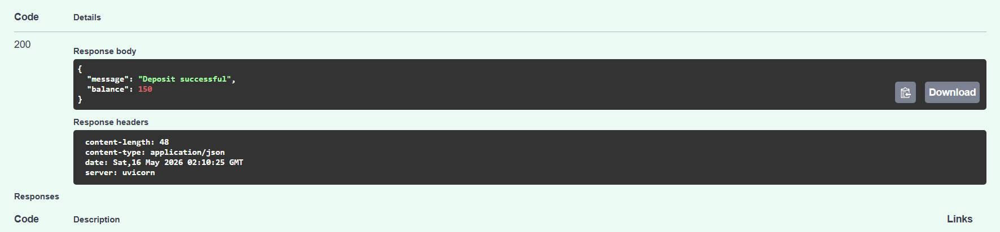
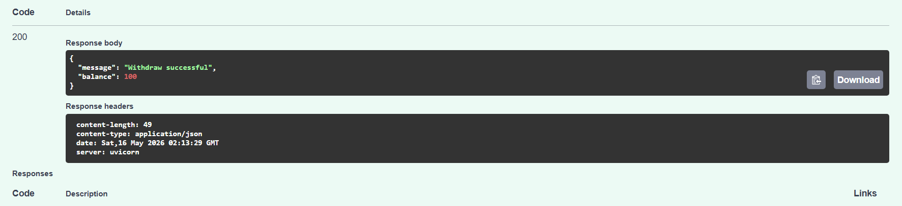
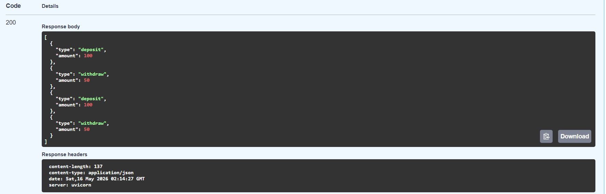

# 🏦 Async Bank API

A modern asynchronous banking API built with FastAPI, JWT authentication, and SQLAlchemy.

This project was developed as a backend challenge focused on authentication, financial transactions, and RESTful API design.

---

# ✨ Features

- User registration
- JWT authentication
- Secure password hashing
- Deposit operations
- Withdraw operations
- Balance validation
- Bank statement generation
- Async database operations
- OpenAPI/Swagger documentation

---

# 🛠 Technologies

- Python
- FastAPI
- SQLAlchemy
- SQLite
- JWT (JSON Web Token)
- Pydantic

---

# 📂 Project Structure

```bash
app/
│
├── core/
├── models/
├── routers/
├── schemas/
├── utils/
└── main.py
```

---

# 🚀 Running the Project

## Clone the repository

```bash
git clone https://github.com/xtheredviper/async-bank-api
```

---

## Enter the project folder

```bash
cd async-bank-api
```

---

## Create virtual environment

```bash
python -m venv venv
```

---

## Activate virtual environment (Windows)

```bash
venv\Scripts\activate
```

---

## Install dependencies

```bash
pip install fastapi uvicorn sqlalchemy aiosqlite python-jose passlib pydantic email-validator
```

---

## Run the server

```bash
uvicorn app.main:app --reload
```

---

# 📘 API Documentation

After running the server, access:

```txt
http://127.0.0.1:8000/docs
```

---

# 🔐 Authentication

This API uses JWT authentication.

After logging in, copy the generated token and use it to access protected endpoints.

---

# 💸 Available Endpoints

## Authentication

| Method | Endpoint |
|---|---|
| POST | `/auth/register` |
| POST | `/auth/login` |

---

## Transactions

| Method | Endpoint |
|---|---|
| POST | `/transactions/deposit` |
| POST | `/transactions/withdraw` |
| GET | `/transactions/statement` |

---

# 📸 API Preview

## Deposit Endpoint



---

## Withdraw Endpoint



---

## Statement Endpoint



---

# 🌙 About This Project

This project was created as a study challenge focused on backend development with asynchronous APIs.

The main goal was to practice:

- API architecture
- Authentication flows
- Database relationships
- Async operations
- RESTful API design principles

---

# 🧠 Challenges Faced

During development, some important backend concepts were explored, including:

- JWT authentication flow
- Password hashing
- Async SQLAlchemy operations
- Request validation
- SQLite persistence
- FastAPI routing structure
- Error handling for financial transactions

---

# 🏆 Final Result

The final application supports:

✅ Secure authentication with JWT  
✅ Deposits and withdrawals  
✅ Balance validation  
✅ Transaction history  
✅ Async database communication  
✅ Interactive Swagger documentation  
